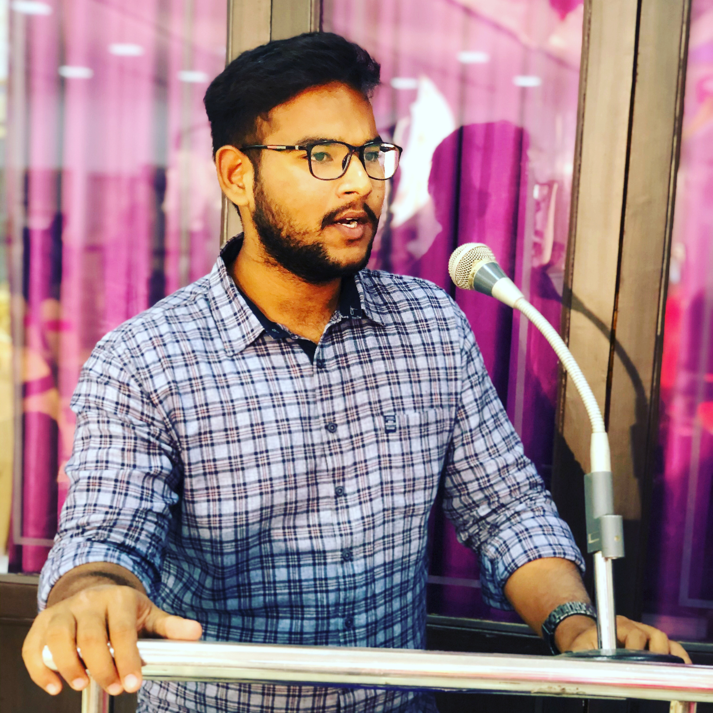

# BHUVANA SAI KRISHNA PAPINENI 

## bhuvanasaikrishna@gmail.com 

## +1 4706439099 

 

 ### ABOUT ME: 

 - I am ready to learn new things and expand my skills. My undergraduate major is Computer Science which includes basic project designing and short-term coding. I was involved in projects like “Student Data Base Management System”, Hospital Management System”.  

### AFTER THIS COURSE: 

- I am expecting me with full knowledge of designing a website myself and I think I will be able to achieve my goals which involves highly paid jobs as “Full Stack developer” and “Sever administrators.” 

### CONCLUSION: 

- I am very thankful to you professor for giving me such opportunity to elaborate myself, and I am looking forward to meeting you in person and learn some important skills to sustain and conquer the “Realtime Software World.” 

 

 

 

 

 

 

 